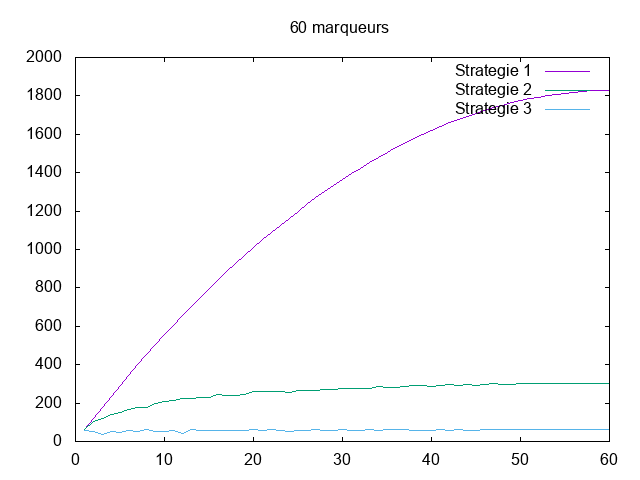

---------------
Experimentateur
---------------

.. toctree::
   :maxdepth: 1

   experience.rst
   marker.rst
   
~~~~~~~~~~
Etat du TP
~~~~~~~~~~

Fini.

Binôme : 
	- Benlamlih Mohammed
	- Abdesselam Lyes

~~~~~~~~~~~~~~~~~~~~~~
Réponses aux questions
~~~~~~~~~~~~~~~~~~~~~~

Indiquez ici les réponses aux questions posées dans le TP. Vous
reprendrez le numéro de la section et le numéro de la question. Par
exemple pour répondre à la question 3 de la section 2.4 vous
indiquerez.

   
Question 1.2.2
--------------

Pour étudier la complexité de cet algorithme on propose de compter le nombre de comparaisons effectuer entre les marqueurs (array markers et array positive markers).

Question 1.2.3
--------------

Non il n'existe pas un pire et un meilleur des cas, quelque soit l'ordre de la liste on va effectuer le meme nombre de comparaison.

Question 1.2.4
--------------

C1(m,p) = la somme de i = 0 à i = p de (m-i) = m + (m-1) + (m-2) + ... + (m-p)

Question 1.3.1
--------------

On crée une boucle pour la liste des marqueurs et on cherche chaque element des marqueurs dans la liste des marqueurs positive en utilisant la recherche dichotomique
On a créer une varibale global dans le fichier sorting pour pouvoir trouver le nombre de comparaison qu'effectue la fonction merge_sort.
Et on affiche le nombre des comparaisons effectuer par la recherche dichotomique (Cd) et le nombre des comparaisons effectuer par la fonction merge_sort (Cm) et le nombre totale des des comparaisons effectuer: Cm + Cd 

Question 1.3.2
--------------

Oui, car on utilise le merge sort et comme on sait le mergesort a un pire et meilleur des cas mais si on ne compte pas le nombre de comparaisons effectuer pas le mergesort (array of positive markers) le nombre de comparaison est stable car pour chaque elements dans la liste on effectue une recharche dichotomique et donc au total le nombre de comparaisons et fixe.

Question 1.4.2
--------------

Oui, car on utilise le mergesort et ce dernier a un pire et un meilleur des cas, mais si on compte pas les nombre de comparaisons effecter par mergesort on a pas de pire et meilleur cas, car pour chaque marqueur on fait une seule comparaison. C3(m) = la longeur de m array des marqueurs (O(n) = n linéaire) et donc le nombre totale des comparaisons est Cm1 = le nombre de comparaison mergesort des markers et Cm2 = le nombre de comparaison mergesort des markers positive + C3(m).

Question 1.5.2
--------------

Pour p = 8 et m = 12 on obtient les résultats suivants:

Markers: [m2 m5 m4 m9 m8 m11 m1 m6 m3 m10 m7 m0]
Positive markers: [m9 m2 m4 m5 m6 m11 m10 m1]

Stratégie 1:
Negative markers: [m8 m3 m7 m0]
Nb. comparisons: 68

Stratégie 2:
Negative markers: [m8 m3 m7 m0]
Nb. comparisons: 33
Nb. comparisons merge: 6
Nb. comparisons totale: 39

Stratégie 3:
Negative markers: [m0 m3 m7 m8]
Nb. comparisons: 12
Nb. comparisons merge: 11
Nb. comparisons totale: 23

On remarque que dans la première stratégie on a 68 comparaisons et pour la deuxième stratégie on obtient 33 comparaisons + 6 comparaisons du mergesort (vu qu'on trie la liste(array) des marqueurs positives) = 39 au total c'est déjà mieux que la première stratégie et finalement dans la troisième stratégie on a 12 comparaisons (la longeur de la liste des marqueurs vu qu'on fait une comparaison par marqueur) + 11 comparaisons du mergesort (vu qu'on trie la liste(array) des marqueurs positives et la liste(array) des marqueurs)

On constate que C3 < C2 < C1 donc on effectue beaucoup moins de comparaisons si on a des listes triées et vu que pour les triées on ne fait pas beaucoup de comparaisons c'est mieux de triées les listes dabord.

Question 1.5.6
--------------

