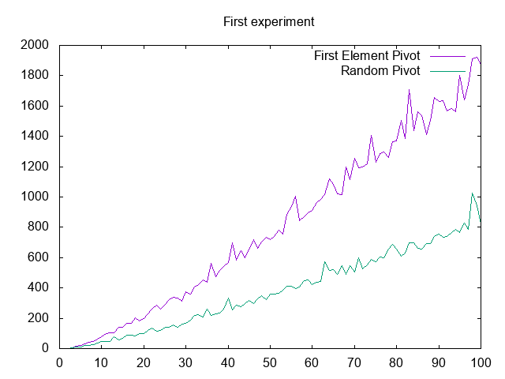
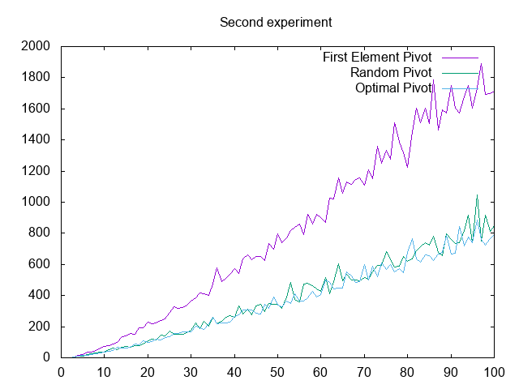
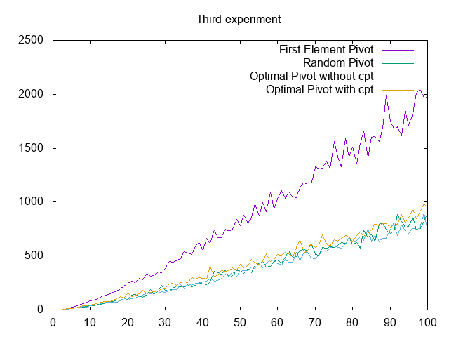

---------
Quicksort
---------

.. toctree::
   :maxdepth: 1

   modules.rst

~~~~~~~~~~
Etat du TP
~~~~~~~~~~

Décrivez ici l'état d'avancement du TP.

~~~~~~~~~~~~~~~~~~~~~~
Réponses aux questions
~~~~~~~~~~~~~~~~~~~~~~

Indiquez ici les réponses aux questions posées dans le TP. Vous
reprendrez le numéro de la section et le numéro de la question. Par
exemple pour répondre à la question 3 de la section 2.4 vous
indiquerez.

   
Question 2.2.1
--------------
D'autres exemples de tris sur place: tri par sélection, tri par insertion et tri à bulles

Question 2.2.3
--------------
Les propriétés qu'on peut donner pour garantir que le partitionnement est correctement réalisé sont:
	1. Le pibot n'appartient a aucune tranche
	2. Les élements de la première tranche (slice) sont forcement plus petit que le pivot
	3. Les élements de la deuxième tranche (slice) sont forcement plus grand que le pivot

Question 2.2.8
--------------
Il n y a pas d'espace mémoire supplémentaire utilisé, a part celui des variables mais on peut l'ignorer et dire que c'est un tri sur place de compléxité memoire O(1) car une fois le tableau créer on n'a plus besoin d'espace mémoire supplémentaire.

Question 2.2.8
--------------

On remarque que le pivot aléatoire est mieux que le pivot en première position, car un pivot pris aléatoirement peut faire des meilleurs et des pires cas contrairement au pivot qui est toujours pris comme première position il ne peux pas etre un meilleur cas.
Déjà pour un tableau de taille 100, on a 800 comparaisons pour le pivot aléatoire alors que pour l'autre cas on a environ 1900 comparaisons et plus la taille augmente plus la difference va etre plus grande.

Question 2.3.1.5
----------------
Le pire des cas, c'est choisir le pivot pour qu'à chaque niveau de la récursivité le découpage conduit à trier un sous-tableau de 1 élement et un sous-tableau contenant tout le reste, la complexité du tri rapide est en O(n**2).
Exemple: prendre le première element de la liste comme pivot et avoit une liste triée. Dans ce cas on va obtenir une compléxité de O(n**2).

L'equation de récurrence: c(n) = 2 + c(n1) + c(n2) + p(n), avec n1 la longeur le la première tranche(slice), n2 la longeur le la deuxième tranche(slice) et p(n) le nombre de comparaison effectuer par la fonction de partition
Pour le pire des cas on a n1 = 1 (donc pas de comparaison) et n2 = n-1 et on a p(n) = n - 1
Donc c(n) = c(0) + c(n-1) + n - 1 = (n*(n-1))/2 donc de l'ordre n**2 O(n**2);

Question 2.3.2.1
----------------
La meilleure valeur à choisir pour le pivot est la médiane de la tranche(slice), comme ca on trie les deux nouvelles tranches de meme taille ou à un près. c'est ceque fait notre fonction optima_pivot 

Question 2.3.2.4
----------------

Question 2.3.2.5
----------------
L'equation de récurrence du tri rapide avec ce choix du pivot devient alors: c(n) = c((n-1)/2) + c((n-1)/2) + n - 1 si n>=2 et c(n) = 0 sinon. Et du coup la complexité dans ce cas est en n*log(n)

Question 2.3.2.4
----------------

On remarque que ce n'est plus le meilleur, et cela va etre plus claire si 

