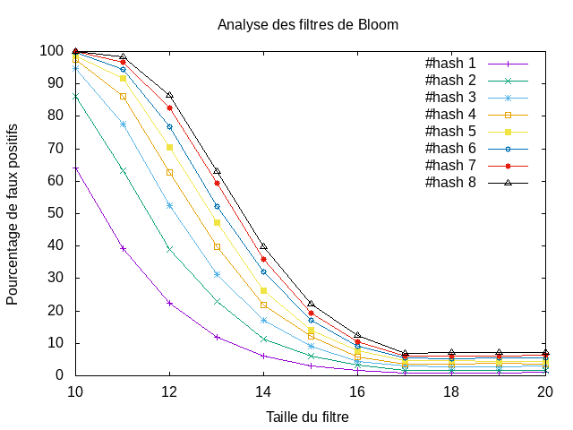

---------------
 tp-bloom
---------------

.. toctree::
   :maxdepth: 1

   bloomfilter.rst

~~~~~~~~~~
Etat du TP
~~~~~~~~~~

Fini.

Binôme : 
	- Benlamlih Mohammed
	- Abdesselam Lyes

Question 4.2.3
--------------

On a détecté un faux positif pour n = 2**4

Question 4.3.4
--------------

On remarque que plus la taille du filtre est petite, plus on a un pourcentage de faux positifs élevé.
Et inversement plus la taille du filtre est grande, plus on a un pourcentage de faux positifs petit.

Fin.